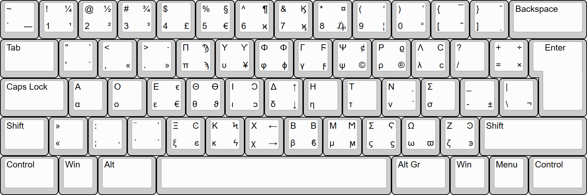

# Greek Dvorak Keyboard Layout

This is a Windows port of the Linux/Unix implementation of Greek Dvorak, with chained dead keys for polytonic accentuation. 

## Building
Compilation requires KbdEdit which can be obtained [here](http://www.kbdedit.com/).
